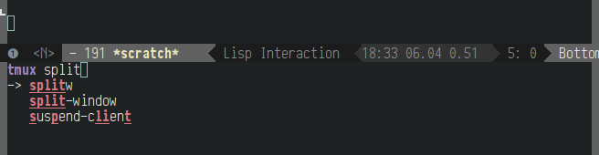
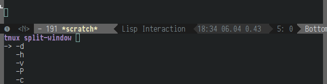
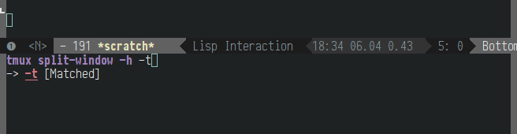
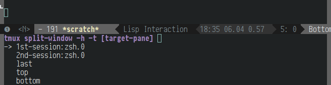
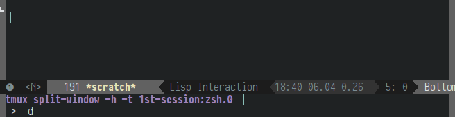

# turnip.el
*Interacting with tmux from Emacs*

Turnip is a package to ease interacting with a tmux session from Emacs.
Its scope and philosophy is inspired by Tim Pope's [vim-tbone][tbone].

[tbone]: https://github.com/tpope/vim-tbone

## Interactive Functions

### turnip-attach

Change the default session. Note that you can always interact with other
sessions by using a session prefix when specifying a pane or window
(`session:window.pane`, see `target-window` in the tmux man page).
If only one session is available, it will be used without displaying a prompt.
This also resets the last used pane.

### turnip-command

Interactively prompts for a tmux command and arguments then executes
this command once no more input is provided (cancel using `C-g`, as usual)[^1]:

[^1]: Note that I'm using [ido-ubiquitous](https://github.com/DarwinAwardWinner/ido-ubiquitous)
      and [ido-vertical-mode](https://github.com/gempesaw/ido-vertical-mode.el).

Select the tmux command and press `RET`:

Select an option or enter any text to use as next argument:

Here `-h` was entered:

After pressing `RET` and entering `-t`:

After pressing `RET` once again, completion for the target pane is offered:

After the next press of `RET`, execution is only one key press away!

Just confirm once more and the command will be sent to tmux.

### turnip-send-region

Sends region to a tmux pane. If no mark is set defaults to send the whole buffer.
The last used pane is saved and used as a default on subsequent calls.

### turnip-send-region-to-buffer

Same as `turnip-send-region` but stores region in a tmux buffer.

## [License](LICENSE)

Copyright © 2014 Johann Klähn

This program is free software; you can redistribute it and/or modify
it under the terms of the GNU General Public License as published by
the Free Software Foundation, either version 3 of the License, or
(at your option) any later version.

This program is distributed in the hope that it will be useful,
but WITHOUT ANY WARRANTY; without even the implied warranty of
MERCHANTABILITY or FITNESS FOR A PARTICULAR PURPOSE.  See the
GNU General Public License for more details.

You should have received a copy of the GNU General Public License
along with this program.  If not, see <http://www.gnu.org/licenses/>.
